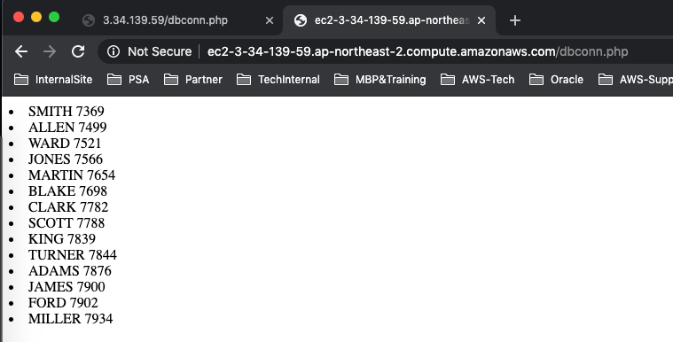

**APACHE PHP MYSQL Install**

```
root@ip-172-31-1-203:/root# apt-get install apache2
root@ip-172-31-1-203:/root# apt-get install php

root@ip-172-31-1-203:/root# apt-get install mysql-client
root@ip-172-31-1-203:/root# apt-get install php-mysql;

root@ip-172-31-1-203:/root# apt-get install libapache2-mod-php
root@ip-172-31-1-203:/root# service apache2 restart;
```


**Apache Daemon Check**

```
root@ip-172-31-1-203:/root# netstat -an |grep 80
tcp        0      0 172.31.1.203:56254      13.124.245.230:80       TIME_WAIT  
tcp        0      0 172.31.1.203:38902      13.124.255.209:80       TIME_WAIT  
tcp        0      0 172.31.1.203:38908      13.124.255.209:80       TIME_WAIT  
tcp6       0      0 :::80                   :::*                    LISTEN     
unix  3      [ ]         STREAM     CONNECTED     13802    
root@ip-172-31-1-203:/root# lsof -i -P -n |grep 80
apache2   12595     root    4u  IPv6  33574      0t0  TCP *:80 (LISTEN)
apache2   12598 www-data    4u  IPv6  33574      0t0  TCP *:80 (LISTEN)
apache2   12599 www-data    4u  IPv6  33574      0t0  TCP *:80 (LISTEN)
apache2   12600 www-data    4u  IPv6  33574      0t0  TCP *:80 (LISTEN)
apache2   12601 www-data    4u  IPv6  33574      0t0  TCP *:80 (LISTEN)
apache2   12602 www-data    4u  IPv6  33574      0t0  TCP *:80 (LISTEN)
```


**Check Public Hostname**

```
root@ip-172-31-1-203:/root# curl http://169.254.169.254/latest/meta-data/public-hostname
ec2-3-34-139-59.ap-northeast-2.compute.amazonaws.com
```


**Check HTTP Connectiong from Client**

```
root@ip-172-31-0-254:/root# curl http://ec2-3-34-139-59.ap-northeast-2.compute.amazonaws.com

<!DOCTYPE html PUBLIC "-//W3C//DTD XHTML 1.0 Transitional//EN" "http://www.w3.org/TR/xhtml1/DTD/xhtml1-transitional.dtd">
....
```


**Connection Check From PHP Server to RDS MariaDB**

```
root@ip-172-31-1-203:/root# mysql -uadmin -hmysql.cf89zyffo8dr.ap-northeast-2.rds.amazonaws.com -p -e "show databases";
Enter password: 
+--------------------+
| Database           |
+--------------------+
| RDS_MARIADB        |
| information_schema |
| mysql              |
| performance_schema |
| sales              |
+--------------------+
```


**Create New Database to Check PHP Connection**

```
root@ip-172-31-1-203:/root# cat /root/sql/sample.sql 
CREATE database SCOTT;

USE SCOTT;


CREATE TABLE IF NOT EXISTS `BONUS` (
  `ENAME` varchar(10) DEFAULT NULL,
  `JOB` varchar(9) DEFAULT NULL,
  `SAL` double DEFAULT NULL,
  `COMM` double DEFAULT NULL
) ENGINE=InnoDB DEFAULT CHARSET=utf8;


CREATE TABLE IF NOT EXISTS `DEPT` (
  `DEPTNO` int(11) NOT NULL,
  `DNAME` varchar(14) DEFAULT NULL,
  `LOC` varchar(13) DEFAULT NULL,
  PRIMARY KEY (`DEPTNO`)
) ENGINE=InnoDB DEFAULT CHARSET=utf8;


INSERT INTO `DEPT` (`DEPTNO`, `DNAME`, `LOC`) VALUES
(10, 'ACCOUNTING', 'NEW YORK'),
(20, 'RESEARCH', 'DALLAS'),
(30, 'SALES', 'CHICAGO'),
(40, 'OPERATIONS', 'BOSTON');


CREATE TABLE IF NOT EXISTS `EMP` (
  `EMPNO` int(11) NOT NULL,
  `ENAME` varchar(10) DEFAULT NULL,
  `JOB` varchar(9) DEFAULT NULL,
  `MGR` int(11) DEFAULT NULL,
  `HIREDATE` datetime DEFAULT NULL,
  `SAL` double DEFAULT NULL,
  `COMM` double DEFAULT NULL,
  `DEPTNO` int(11) DEFAULT NULL,
  PRIMARY KEY (`EMPNO`),
  KEY `PK_EMP` (`DEPTNO`)
) ENGINE=InnoDB DEFAULT CHARSET=utf8;


INSERT INTO `EMP` (`EMPNO`, `ENAME`, `JOB`, `MGR`, `HIREDATE`, `SAL`, `COMM`, `DEPTNO`) VALUES
(7369, 'SMITH', 'CLERK', 7902, '1980-12-17 00:00:00', 800, NULL, 20),
(7499, 'ALLEN', 'SALESMAN', 7698, '1981-02-20 00:00:00', 1600, 300, 30),
(7521, 'WARD', 'SALESMAN', 7698, '1981-02-22 00:00:00', 1250, 500, 30),
(7566, 'JONES', 'MANAGER', 7839, '1981-04-02 00:00:00', 2975, NULL, 20),
(7654, 'MARTIN', 'SALESMAN', 7698, '1981-09-28 00:00:00', 1250, 1400, 30),
(7698, 'BLAKE', 'MANAGER', 7839, '1981-05-01 00:00:00', 2850, NULL, 30),
(7782, 'CLARK', 'MANAGER', 7839, '1981-06-09 00:00:00', 2450, NULL, 10),
(7788, 'SCOTT', 'ANALYST', 7566, '1987-04-19 00:00:00', 3000, NULL, 20),
(7839, 'KING', 'PRESIDENT', NULL, '1981-11-17 00:00:00', 5000, NULL, 10),
(7844, 'TURNER', 'SALESMAN', 7698, '1981-09-08 00:00:00', 1500, 0, 30),
(7876, 'ADAMS', 'CLERK', 7788, '1987-05-23 00:00:00', 1100, NULL, 20),
(7900, 'JAMES', 'CLERK', 7698, '1981-12-03 00:00:00', 950, NULL, 30),
(7902, 'FORD', 'ANALYST', 7566, '1981-12-03 00:00:00', 3000, NULL, 20),
(7934, 'MILLER', 'CLERK', 7782, '1982-01-23 00:00:00', 1300, NULL, 10);

CREATE TABLE IF NOT EXISTS `SALGRADE` (
  `GRADE` double DEFAULT NULL,
  `LOSAL` double DEFAULT NULL,
  `HISAL` double DEFAULT NULL
) ENGINE=InnoDB DEFAULT CHARSET=utf8;


INSERT INTO `SALGRADE` (`GRADE`, `LOSAL`, `HISAL`) VALUES
(1, 700, 1200),
(2, 1201, 1400),
(3, 1401, 2000),
(4, 2001, 3000),
(5, 3001, 9999);


ALTER TABLE `EMP`
  ADD CONSTRAINT `PK_EMP` FOREIGN KEY (`DEPTNO`) REFERENCES `DEPT` (`DEPTNO`) ON DELETE SET NULL ON UPDATE CASCADE;
```


**Insert SCOTT Sample Data into SCOT Database in RDS MariaDB**

```
root@ip-172-31-1-203:/root# mysql -uadmin -hmysql.cf89zyffo8dr.ap-northeast-2.rds.amazonaws.com -p < /root/sql/sample.sql 
```


**Create Sample PHP page to use RDS Connection**

```
root@ip-172-31-1-203:/var/www/html# cat dbconn.php 
<!DOCTPYE>
<html>
 <head><meta charset="utf-8"></head>
<body>
<?php
$write = mysqli_connect("mysql.cf89zyffo8dr.ap-northeast-2.rds.amazonaws.com","admin","DB-PASSWORD","SCOTT");
$read = mysqli_connect("mysql.cf89zyffo8dr.ap-northeast-2.rds.amazonaws.com","admin","DB-PASSWORD","SCOTT");

$sql="SELECT ENAME, EMPNO FROM EMP order by 2";
$result=mysqli_query($read,$sql);
 
while($row=mysqli_fetch_assoc($result)){
 $ENAME=mysqli_real_escape_string($read,$row['ENAME']);
 $EMPNO=mysqli_real_escape_string($read,$row['EMPNO']);
 print("<li>{$ENAME} {$EMPNO}</li>");
}
?>
   </body>
</html>
```


**Check dbconn.php connection From Client**

```
root@ip-172-31-0-254:/root# curl http://ec2-3-34-139-59.ap-northeast-2.compute.amazonaws.com/dbconn.php
<!DOCTPYE>
<html>
 <head><meta charset="utf-8"></head>
<body>
<li>SMITH 7369</li><li>ALLEN 7499</li><li>WARD 7521</li><li>JONES 7566</li><li>MARTIN 7654</li><li>BLAKE 7698</li><li>CLARK 7782</li><li>SCOTT 7788</li><li>KING 7839</li><li>TURNER 7844</li><li>ADAMS 7876</li><li>JAMES 7900</li><li>FORD 7902</li><li>MILLER 7934</li>   </body>
</html>
```

<kbd>  </kbd>
